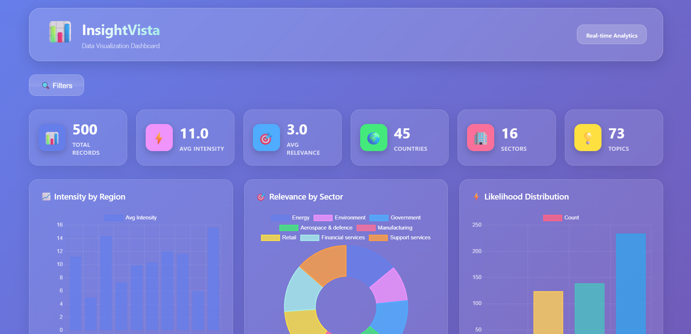
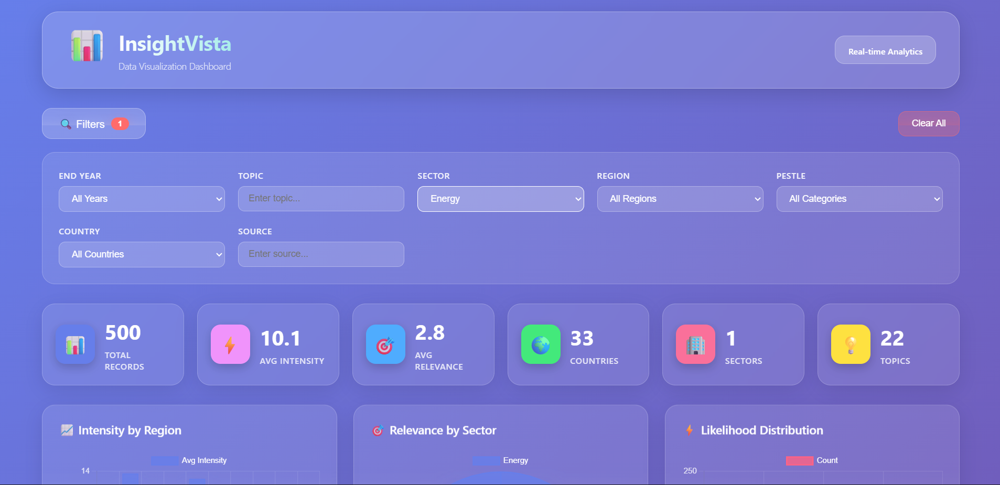
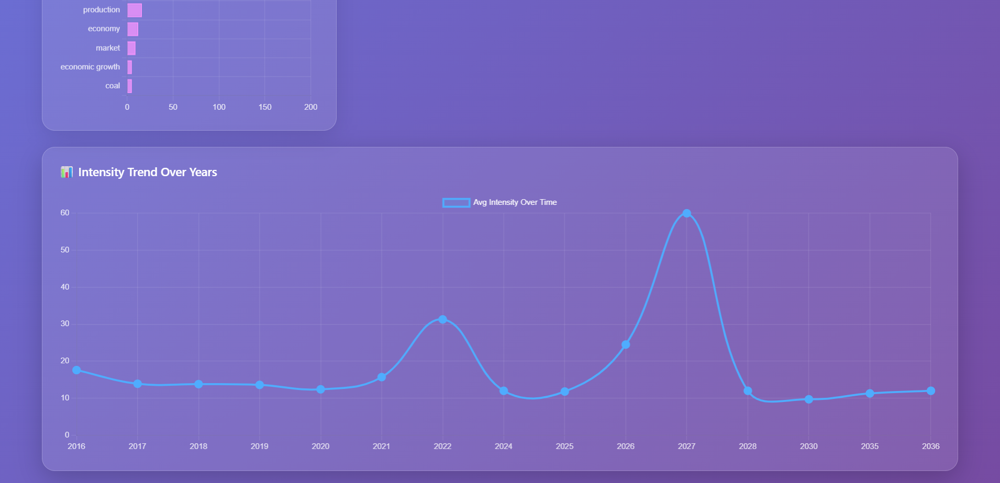



  <h1>📊 InsightVista</h1>
  
<strong>Data Visualization Dashboard for Global Business Insights</strong>

  
  
  
  
  

---

## 🎯 Overview

InsightVista is a full-stack MERN application that transforms complex business data into interactive visualizations. Built for Blackcoffer's visualization assignment, it features dynamic filtering, real-time chart updates, and a modern glassmorphism UI.

**Live Demo:** [Coming Soon] 🚀  
**GitHub:** [https://github.com/Harsh427744/insight-vista](https://github.com/Harsh427744/insight-vista)

---

## 📸 Screenshots

### Dashboard Overview

### Interactive Filters

### Stats Cards

### Charts & Visualizations

---

## ✨ Features

### 📊 **Data Visualizations**
- **Intensity by Region** - Bar chart showing regional intensity averages
- **Relevance by Sector** - Doughnut chart for sector-wise relevance
- **Likelihood Distribution** - Bar chart categorizing likelihood levels
- **Top 10 Topics** - Horizontal bar chart of most frequent topics
- **Intensity Trend Over Years** - Line chart showing temporal trends

### 🔍 **Advanced Filtering**
- End Year, Topic, Sector, Region
- PESTLE categories, Source, Country
- Real-time chart updates on filter change
- Clear all filters with one click

### 🎨 **Modern UI/UX**
- Purple gradient background with glassmorphism effects
- Smooth animations and hover effects
- Responsive design for desktop and laptop
- Interactive stat cards with live metrics

### 🔌 **RESTful API**
- Clean Express.js backend
- MongoDB Atlas integration
- Query parameter-based filtering
- CORS-enabled for cross-origin requests

---

## 🛠️ Tech Stack

| Layer | Technologies |
|-------|-------------|
| **Frontend** | React.js, Chart.js, Axios, CSS3 |
| **Backend** | Node.js, Express.js, Mongoose |
| **Database** | MongoDB Atlas |
| **Visualization** | Chart.js, react-chartjs-2 |
| **Dev Tools** | nodemon, dotenv, cors |

---

## 📋 Prerequisites

- **Node.js** v16.0 or higher
- **npm** or **yarn**
- **MongoDB Atlas** account (free tier works)
- **Git** for version control

---

## 🚀 Quick Start

### 1️⃣ Clone the Repository

git clone https://github.com/Harsh427744/insight-vista.git

cd insight-vista

### 2️⃣ Backend Setup

cd backend
npm install

Create `.env` file in `backend/`:

MONGO_URI=your_mongodb_atlas_connection_string
PORT=5000

Start the backend:

npm run dev
Backend runs at: `http://localhost:5000`

### 3️⃣ Import Data to MongoDB

Verify at: `http://localhost:5000/api/data`

### 4️⃣ Frontend Setup

cd frontend
npm install
npm start

Frontend runs at: `http://localhost:3000`

---

## 📁 Project Structure

insight-vista/
├── backend/
│ ├── models/
│ │ └── Data.js # Mongoose schema
│ ├── routes/
│ │ └── dataRoutes.js # API routes with filtering
│ ├── server.js # Express app entry
│ ├── .env # Environment variables (gitignored)
│ └── package.json
├── frontend/
│ ├── public/
│ ├── src/
│ │ ├── components/
│ │ │ ├── Header.js # Dashboard header
│ │ │ ├── Filters.js # Filter controls
│ │ │ ├── StatsCards.js # Metric cards
│ │ │ ├── Charts.js # All visualizations
│ │ │ └── Loader.js # Loading spinner
│ │ ├── pages/
│ │ │ └── Dashboard.js # Main dashboard page
│ │ ├── services/
│ │ │ └── api.js # Axios API calls
│ │ ├── App.js
│ │ └── index.css # Global styles
│ └── package.json
├── screenshots/ # Dashboard images
├── .gitignore
└── README.md

---

## 🌐 API Reference

### **GET** `/api/data`

Fetches filtered or unfiltered data from MongoDB.

**Query Parameters:**

| Parameter | Type | Description | Example |
|-----------|------|-------------|---------|
| `end_year` | String | Filter by end year | `2025` |
| `topic` | String | Filter by topic | `oil` |
| `sector` | String | Filter by sector | `Energy` |
| `region` | String | Filter by region | `Northern America` |
| `pestle` | String | Filter by PESTLE | `Political` |
| `source` | String | Filter by source | `EIA` |
| `country` | String | Filter by country | `United States of America` |

**Example Request:**

GET http://localhost:5000/api/data?region=Asia&sector=Energy&end_year=2025

**Response:**

[
{
"_id": "...",
"end_year": "2025",
"intensity": 6,
"sector": "Energy",
"topic": "gas",
"region": "Asia",
"country": "China",
"relevance": 3,
"likelihood": 2,
...
}
]

---

## 🎨 Dashboard Features in Detail

### Stats Cards
- **Total Records**: Current filtered dataset size
- **Avg Intensity**: Mean intensity value
- **Avg Relevance**: Mean relevance score
- **Countries**: Unique country count
- **Sectors**: Unique sector count
- **Topics**: Unique topic count

### Filter Panel
- Collapsible filter section
- Active filter count badge
- Clear all functionality
- Dropdowns for predefined values
- Text inputs for custom searches

### Charts
1. **Bar Chart** - Intensity by Region (top 10)
2. **Doughnut Chart** - Relevance by Sector (top 8)
3. **Bar Chart** - Likelihood Distribution (4 levels)
4. **Horizontal Bar** - Top 10 Topics by frequency
5. **Line Chart** - Intensity trend over years

---

## 🚀 Deployment Guide

### Backend (Render.com)

1. Push code to GitHub
2. Go to [render.com](https://render.com) → New Web Service
3. Connect your GitHub repo
4. Set:
   - **Build Command**: `cd backend && npm install`
   - **Start Command**: `cd backend && npm start`
   - **Environment Variables**: Add `MONGO_URI` and `PORT`
5. Deploy!

### Frontend (Vercel)

1. Go to [vercel.com](https://vercel.com) → Import Project
2. Select your GitHub repo
3. Set **Root Directory**: `frontend`
4. Add Environment Variable:
   - `REACT_APP_API_URL` = your Render backend URL
5. Deploy!

Update `frontend/src/services/api.js`:

const API_BASE_URL = process.env.REACT_APP_API_URL || 'http://localhost:5000/api';

---

## 📊 Data Source

**Dataset:** `jsondata.json` (provided by Blackcoffer)  
**Records:** 1000 business insights  
**Fields:** intensity, likelihood, relevance, year, country, topic, sector, region, PESTLE, source, etc.

---

## 🎯 Assignment Requirements Met

✅ MongoDB database integration  
✅ RESTful API with Express.js  
✅ React.js frontend with Chart.js  
✅ 5+ interactive visualizations  
✅ 8+ functional filters (end year, topic, sector, region, PESTLE, source, country, and dynamic search)  
✅ Responsive glassmorphism UI  
✅ Real-time chart updates  

---

## 🔮 Future Enhancements

- [ ] User authentication and saved views
- [ ] Export charts as PNG/PDF
- [ ] Advanced aggregations (year-over-year, sector trends)
- [ ] Geospatial map visualizations
- [ ] Dark mode toggle
- [ ] Mobile responsive version

---

## 👨‍💻 Author

**Harsh Agarwal**

---

## 📝 License

This project was created as an assignment for **Blackcoffer's Full-Stack Visualization Test**.

---

## 🙏 Acknowledgments

- **Blackcoffer** for the assignment opportunity
- **MongoDB Atlas** for cloud database hosting
- **Chart.js** for powerful visualizations
- **React.js** community for excellent documentation

---

  
⭐ If you found this project interesting, consider giving it a star!

  
Built with ❤️ by Harsh Agarwal

